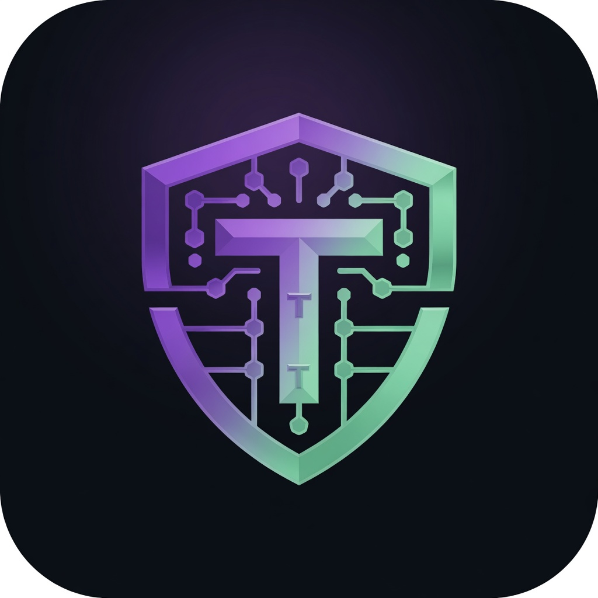
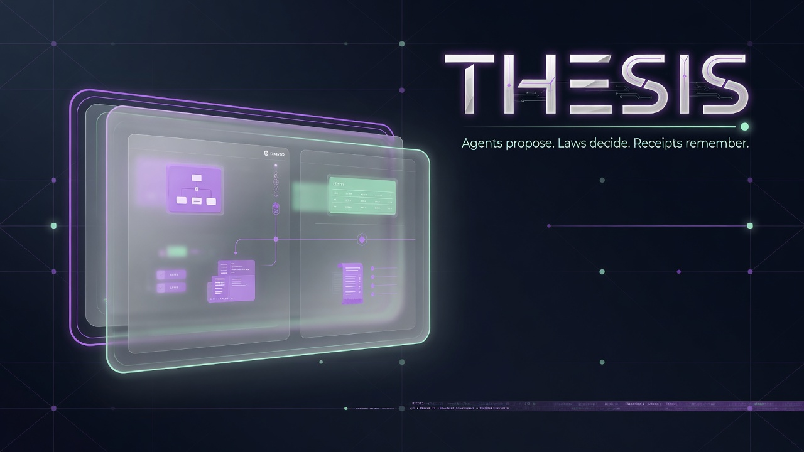
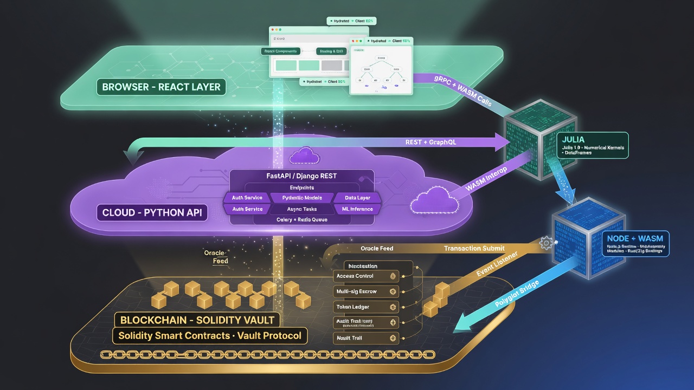

<p align="center">
  
</p>

<h1 align="center">MonadBuilder+ · THESIS</h1>

<p align="center">
  <strong>Build the application. Govern the intelligence. Execute on Monad.</strong><br/>
  AI creation, interoperable wallets, agents, policy, execution, CLI operations, and cryptographic receipts in one stack.
</p>

<p align="center">
  <a href="https://monados.medinatechlabs.net"></a>
  <a href="https://github.com/ItsNotAILABS/Monad-Hackaton"></a>
  
</p>

<p align="center">
  
  
  
  
  
  
</p>

<p align="center">
  
</p>

## One product, two coordinated platforms

| Platform | What it delivers |

| **MonadBuilder+** | AI dApp generation, visual editing, templates, generated wallets, live Monad utilities, publishing, Gallery, education, and AI Studio |
| **THESIS** | Python governance backend, agents, programmable laws, external-wallet identities, sandbox twins, Company OS, controlled execution, smart contracts, CLI, and receipts |

The public Node application exposes THESIS through `/engine/*`, and the installed CLI reaches both `/api/*` and `/engine/*`. Browser users, developers, operators, and agents therefore work against one hosted product rather than disconnected demos.

> **Agents propose. Laws decide. Owners sign. Receipts remember.**

## The problem

Blockchain application development is fragmented across UI frameworks, Solidity, wallets, RPC configuration, deployment scripts, gas logic, governance, and monitoring. AI accelerates creation, but an AI that can propose actions should not automatically receive unrestricted access to wallets or capital.

## The solution

MonadBuilder+ creates the application. THESIS governs what the application and its agents are allowed to do.

1. Describe a dApp in plain language.
2. Generate a validated Monad-specific component layout.
3. Refine it visually and publish the project.
4. Generate a wallet or connect an existing wallet system.
5. Normalize that public wallet identity into roles, custody, capabilities, namespace, and policy.
6. Mirror observable balances into governed THESIS twins without importing keys.
7. Send agent or operator proposals through programmable laws.
8. Reject unlawful actions with explicit reasons.
9. Preserve material actions through receipts and owner-controlled external signing.

## Product capabilities

### AI application studio

- full dApp generation from a natural-language idea;
- prompt expansion into a Monad-specific architecture brief;
- visual component editing and project refinement;
- component validation instead of invented UI types;
- contract, gas, dApp, and governance analysis;
- production-readiness audits;
- Python and JavaScript script generation;
- context-aware assistant across the application.

### Real application surfaces

- wallet connection, generated wallets, and token balances;
- token swaps and transaction feeds;
- NFT galleries and DAO voting;
- price charts and reward surfaces;
- responsive layout primitives;
- database-backed templates;
- project previews, publishing, and Gallery distribution;
- GitHub authentication;
- interactive Learn modules, quizzes, badges, and wallet-linked progress.

## Wallet operating system

Wallets are a core product layer across both platforms.

### MonadBuilder+ generated wallets

The Node platform can generate wallets for users, learners, educators, and AI agents. It supports live MON balance reads, public wallet records, explorer and faucet links, and dedicated Governance, Builder, Auditor, and Rewards agent-wallet roles.

Generated wallets remain part of the MonadBuilder+ application database and can be used by its onboarding, education, project, and agent surfaces.

### THESIS normalized wallet identities

THESIS now maps external wallet systems into a shared public identity model using CAIP-style chain identifiers such as `eip155:10143`.

Supported adapter families include:

| Wallet system | Operating model |
|---|---|
| MetaMask, Rabby, injected EVM | EIP-1193 / EIP-6963 self-custody |
| Phantom | Multichain browser wallet |
| WalletConnect v2, Rainbow | Mobile and session-based connections |
| Coinbase Wallet | EOA connection |
| Coinbase Smart Wallet | Smart-account / account-abstraction capabilities |
| Safe | Multisig treasury or organization account |
| Ledger, Trezor | Hardware-backed signing |
| Privy, Dynamic, embedded wallets | Embedded onboarding with public session references |
| Turnkey | Policy-controlled signing infrastructure |
| Fireblocks | Institutional custody and approval infrastructure |
| Manual / watch-only | Public address observation without signing authority |

Every normalized identity can carry:

- wallet role: user, agent, learner, educator, operator, treasury, auditor, deployer, or multisig signer;
- custody mode: self-custody, smart account, multisig, hardware, embedded, institutional, or watch-only;
- account type and provider family;
- namespace such as personal, company, project, treasury, agent, or team;
- owner reference and policy profile;
- declared capabilities such as message signing, transaction signing, typed data, batching, multisig, hardware, embedded, session keys, or sponsored gas;
- public session references, tags, and observable balances.

THESIS refuses private keys, seed phrases, mnemonics, recovery phrases, and other secret material.

### Wallet twins and governance boundary

Observable balances can be synchronized into THESIS sandbox twins. Twins let agents model portfolio state, run policy checks, plan actions, and produce receipts without receiving authority over the real account.

The real MetaMask, Phantom, Safe, Ledger, Privy, Turnkey, Fireblocks, or other provider remains the signer after policy approval.

> **AI can model the wallet. AI cannot silently control the wallet.**

## Unified CLI

Installing the Python package exposes both command names:

```bash
cd engine
python -m pip install -e .

monadbuilder status
thesis status
```

By default the CLI targets the hosted product. Override it for local or private deployments with `--app-url`, `--engine-url`, `MONADBUILDER_URL`, or `THESIS_URL`.

### Live platform and chain operations

```bash
monadbuilder status
monadbuilder rpc
monadbuilder chain block
monadbuilder chain gas
```

### Generated wallets through MonadBuilder+

```bash
monadbuilder wallets generate --label "Operations Wallet" --role user
monadbuilder wallets generate --label "Auditor Agent" --role agent
```

### Link existing wallet systems into THESIS

```bash
monadbuilder wallets architecture
monadbuilder wallets supported

monadbuilder wallets link 0xYOUR_ADDRESS \
  --kind metamask \
  --role operator \
  --namespace personal \
  --policy-profile owner-controlled

monadbuilder wallets link 0xSAFE_ADDRESS \
  --kind safe \
  --role treasury \
  --namespace company \
  --policy-profile multisig-required \
  --capability multisig=true \
  --balance MON=25
```

### Twin synchronization and operations

```bash
monadbuilder wallets list
monadbuilder wallets primary wid-xxxxxxxxxxxx
monadbuilder wallets balances wid-xxxxxxxxxxxx MON=12.5 USDC=2500
monadbuilder wallets sync --wallet-id wid-xxxxxxxxxxxx
monadbuilder company "Prepare a governed Monad deployment"
monadbuilder receipts --limit 20
monadbuilder terminal "brief"
```

The CLI calls the same live HTTP routes as the application. It is not a separate mock implementation.

## THESIS governance runtime

| Module | Responsibility |
|---|---|
| **EcosystemLaw** | Non-negotiable system rules |
| **LawBook** | Owner-configurable policy |
| **PolicyKernel** | Evaluates every proposed action |
| **SovereignVault** | Gates execution behind policy approval |
| **ReceiptChain** | Records material actions and outcomes |
| **AgentRegistry** | Tracks governed agents |
| **ProposalBook** | Preserves proposals and decisions |
| **ExecutionRouter** | Routes approved execution |
| **Company OS** | Coordinates missions, departments, approvals, and operational state |

THESIS evaluates slippage, exposure, reserves, leverage, action value, allowed categories, wallet role, namespace, custody mode, and policy profile. A rejected action returns violated rules and human-readable reasons rather than a fake success toast.

## Live Monad connectivity

The stack uses Monad Testnet, Chain ID `10143`, and exposes live block, gas, native MON balance, wallet refresh, RPC health, explorer, deployment-state, and receipt operations. Unavailable upstream services fail honestly instead of returning fabricated market values.

## Smart-contract system

`PolicyKernel.sol` · `SovereignVault.sol` · `LawBook.sol` · `ReceiptChain.sol` · `AgentRegistry.sol` · `ProposalBook.sol` · `ExecutionRouter.sol` · `ThesisFactory.sol`

A submission contract address must come from a real Monad deployment transaction. This repository does not substitute token addresses or invented values.

## Architecture

<p align="center">
  
</p>

```text
Browser / CLI / external AI
  └─ MonadBuilder+ React Studio + Node API
       ├─ projects, templates, AI, chain data, generated wallets
       └─ /engine/* gateway
            └─ THESIS FastAPI
                 ├─ laws, agents, Company OS, tools and receipts
                 ├─ normalized wallet identities
                 │    ├─ provider + role + custody + capabilities
                 │    └─ governed read-only sandbox twins
                 └─ Monad contracts
                      PolicyKernel → SovereignVault → ReceiptChain
```

## Public wallet and CLI routes

```text
/api/wallets/generate
/api/wallets/:address/balance
/engine/wallets/architecture
/engine/wallets/supported
/engine/wallets/v2
/engine/wallets/v2/link
/engine/wallets/v2/{wallet_id}/primary
/engine/wallets/v2/{wallet_id}/balances
/engine/wallets/v2/sync-twins
```

## Run the complete stack

```bash
bash scripts/replit_start.sh
```

The script starts THESIS internally on port `8043`, builds the pnpm workspace, runs database setup when configured, and launches the public Node application on `$PORT`.

## Repository map

```text
artifacts/monad-builder/   React application studio
artifacts/api-server/      Node API and THESIS gateway
artifacts/monad-mobile/    Mobile product lane
engine/                    Python THESIS backend and unified CLI
contracts/                 Solidity and Foundry contracts
lib/                       Shared TypeScript and database packages
web/                       Dedicated THESIS interface
polyglot/                  Julia and Node execution engines
receipts/                  Runtime receipts and deployment records
docs/                      Architecture and product documentation
scripts/                   Startup, validation, and deployment automation
```

## Hackathon submission

**Description**  
MonadBuilder+ · THESIS is an AI-powered application creation and governance platform for Monad. Users generate and publish dApps, generate or connect wallets, inspect live chain state, and operate through a Python backend and CLI that normalize wallet systems, evaluate agent actions under programmable laws, and preserve receipts.

**Problem**  
Blockchain creation is fragmented and inaccessible, while AI agents introduce risk when actions lack policy controls, interoperable wallet boundaries, and accountable records.

**Solution**  
MonadBuilder+ provides the visual AI creation environment. THESIS supplies the control plane: generated and linked wallet systems, normalized identity and custody metadata, sandbox twins, programmable law, explicit rejection, owner-controlled signing, Company OS coordination, CLI operations, contracts, and receipt-backed accountability.

**Project URL:** https://monados.medinatechlabs.net  
**GitHub:** https://github.com/ItsNotAILABS/Monad-Hackaton  
**Category:** Monad Testnet  
**Contract address:** use the verified address from the actual deployment transaction.

## Social post

> We built **MonadBuilder+ · THESIS**: one platform to create, operate, and govern applications on Monad. Generate a complete dApp with AI, generate or connect wallets across self-custody, smart accounts, multisig, hardware, embedded, and institutional systems, inspect live chain state, and route agent actions through programmable laws, owner-controlled signing, CLI operations, and cryptographic receipts.  
>  
> **Agents propose. Laws decide. Owners sign. Receipts remember.**  
>  
> https://monados.medinatechlabs.net  
> https://github.com/ItsNotAILABS/Monad-Hackaton  
>  
> #Monad #BuildOnMonad #AI #Web3 #SparkHackathon

---

<p align="center">
  <strong>MonadBuilder+ creates the application. THESIS makes autonomous operation governable.</strong>
</p>
